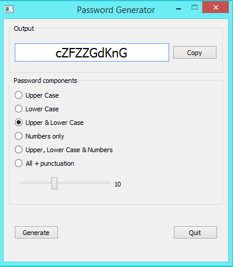

# pyQT-PasswordGenerator
Simple Python code using pyQT to generate pseudo-random passwords

Password Generator window as it appears on macOS (for some as yet unknown reason the radio buttons do not appear evenly spaced on macOS)

Password Generator window as it appears on Windows 10 (note the even spacing of radio buttons)

