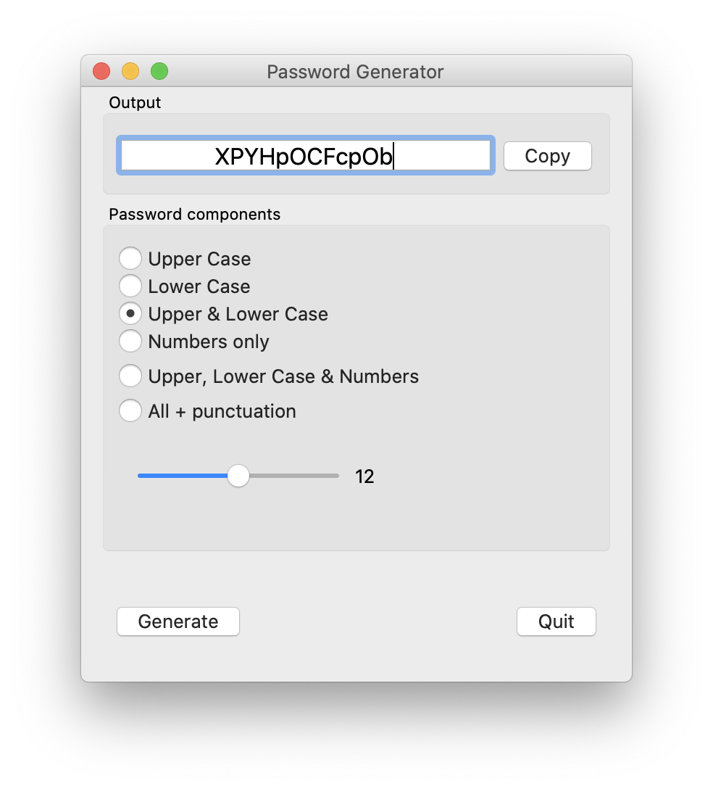

# pyQT-PasswordGenerator
Simple Python code using pyQT to generate pseudo-random passwords

Password Generator window as it appears on macOS (for some as yet unknown reason the radio buttons do not appear evenly spaced on macOS but fine on Windows 10)

I hope the usage from here is perfectly understandable (horizontal slider to change the length of required password, radio buttons to select the type of characters, Generate button to make new password and Copy button to move to clipboard.

Please feel free to use/modify to your hearts content. The code is not the prettiest or the best and I in no way claim to be a programmer (It's just a hobby). If you think you can improve it, please go ahead.
